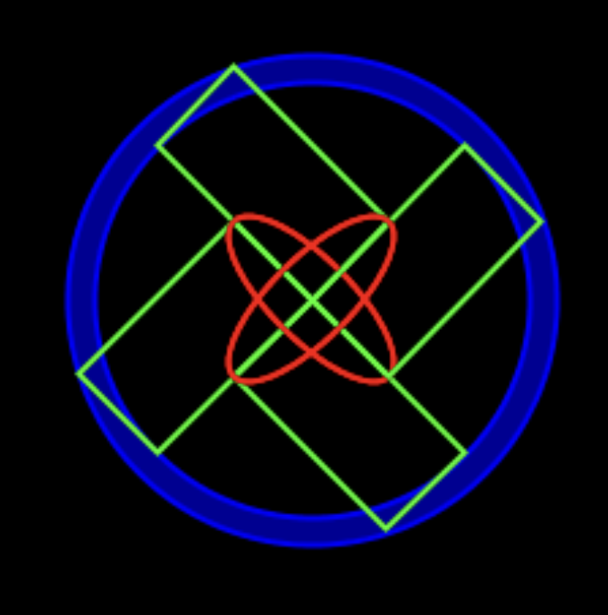
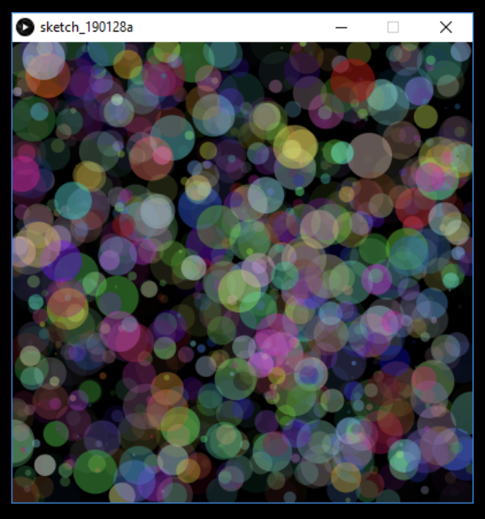

# Lecture Activity Bonus 1

If you missed any of the past lecture activities, complete this bonus for marks.

For each activity, within this README file, embed a screenshot of your code as well as the drawing that is generated after you run your code.

## Task 1 - The Wheel

Write code to produce the output below. 

You can only use rect() and ellipse() functions to draw the shapes. 

All shapes must be located at (x,y) = (0,0), i.e. the origin of the shape is (0,0) – use coordinate transformation to place the shapes. 



## Task 2 - Rotate the Wheel

You should re-use your PDE file from Lecture Activity 4 Task 1. 
Remember, you can copy a file using the Terminal:

```
cp path\to\file1.pde path\to\copiedfile1.pde
```
Create an animation where the speed and rotation of the wheel are controlled by mouseX.
* When mouseX is 0, the wheel freezes.
* The higher value mouseX is, the faster the wheel moves to the right while rotating.

When any key is pressed, the wheel’s location is 
reset (far left) and it stops rotation.

* Idea: Reuse the code of the wheel presented in last lecture’s notes:
  - declare two variables: x and dr and  initialize both to 0. 
  - Use the two variables to transform your wheel.
  - Both variables should be updated every frame using mouseX.
  - Whenever a key is pressed, both variables should be set to 0.

Add a screenshot of your code and solution below this line:

## Task 3 - Random Colors
Write code to display circles at random locations with random colors and transparencies. 
  
  *Hint:* Don’t clear the background every frame.  



Add a screenshot of your code and solution below this line:
